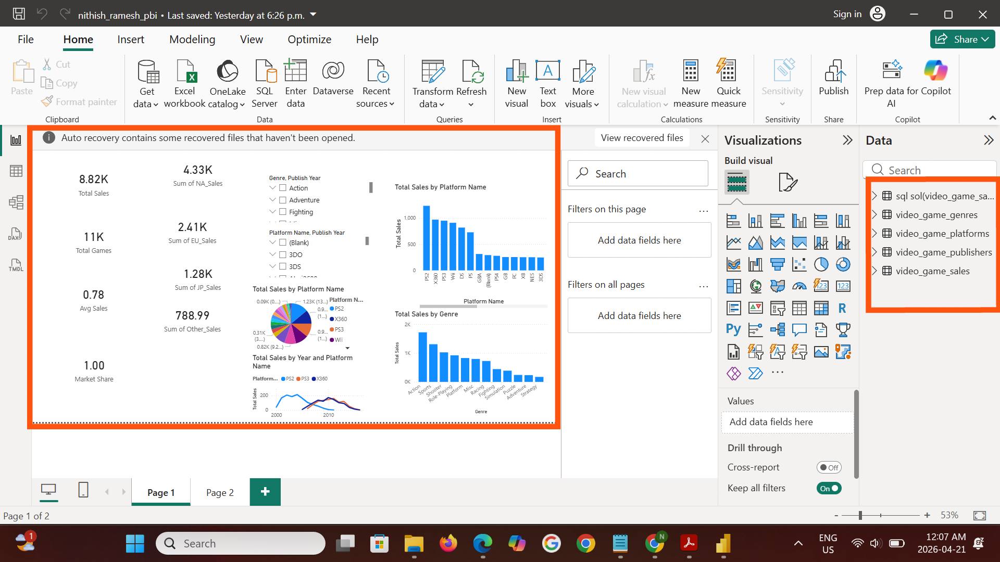

# 🎮 **Video Game Sales Analysis**

## 📌 Project Overview

This project analyzes 16,000+ video game sales records to uncover trends in platforms, publishers, genres, and regional performance using Excel, SQL, and Power BI.

---

## 🎯 Business Problem

The objective is to identify:

* Top-performing platforms
* Leading publishers
* Popular game genres
* Regional sales trends
* Global revenue patterns

---

## 🛠️ Tools Used

* **MS Excel**
* **SQL**
* **Power BI**
* **Data Visualization**
* **Business Analytics**

---

## 📂 Dataset

* **Source:** Kaggle
* **Records:** 16,000+

### Columns Included

* Platform
* Genre
* Publisher
* Year
* Regional Sales
* Global Sales

---

## 🔄 Data Cleaning (Excel)

* Removed duplicates
* Handled missing values
* Standardized column formats
* Checked data consistency

---

## 🧠 SQL Analysis

### Key Analysis Performed

* Total Global Sales by Publisher
* Top Selling Platforms
* Genre-wise Revenue Analysis
* Regional Sales Comparison
* Year-wise Sales Trends

### Example SQL Query

```sql
SELECT Publisher, SUM(Global_Sales) AS Total_Sales
FROM video_games
GROUP BY Publisher
ORDER BY Total_Sales DESC;
```

---

## 📊 Power BI Dashboard Features

* Total Global Sales KPI
* Top Publishers Analysis
* Platform Performance Comparison
* Genre Distribution
* Regional Sales Visualization
* Interactive Filters & Slicers

---

## 📸 Dashboard Preview



---

## 🔍 Key Insights

* Nintendo generated the highest global sales.
* Action genre showed the highest popularity.
* North America contributed major sales revenue.
* Some platforms dominated specific regions.

---

## 🚀 Outcome

This project demonstrates an end-to-end data analytics workflow using Excel, SQL, and Power BI for business intelligence and sales analysis.

---

## 🏷️ Skills Demonstrated

#Excel #SQL #PowerBI #DataAnalytics #BusinessIntelligence #DataVisualization #DashboardDesign #AnalyticsProject #GitHubPortfolio
